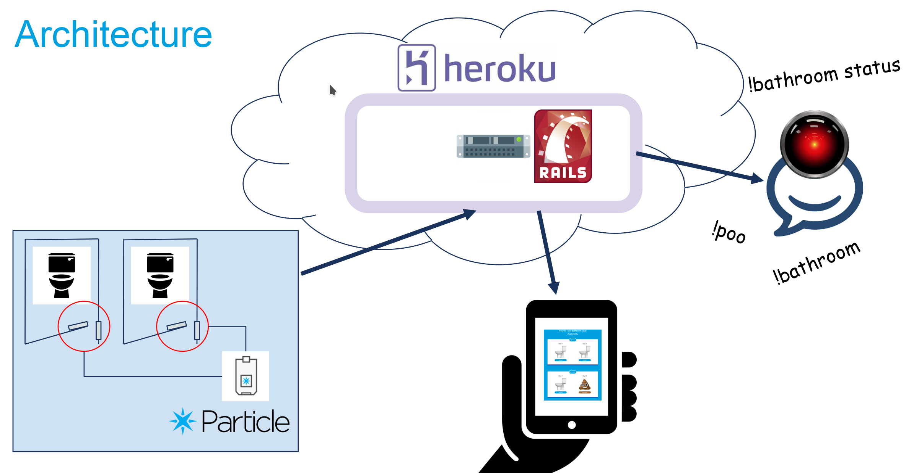
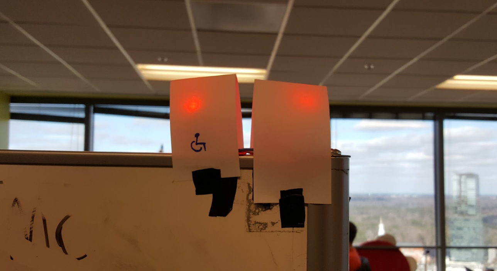

# Bathroom LEDs

This project was part of a hackweek at Pardot. It used the [bathroom monitor](https://www.wiggletonabbey.com/projects/bathroom-monitor) API to detect the state of bathroom stalls and updated status LEDs accordingly. 

## Project Overview

The core project used a Particle Photon and magnetic reed switches to sense the state of the bathroom stalls. When the magnets are close enough to activate, the stall is considered "in use". This project polled the bathroom stall API and displayed them on conveniently located LEDs. 
